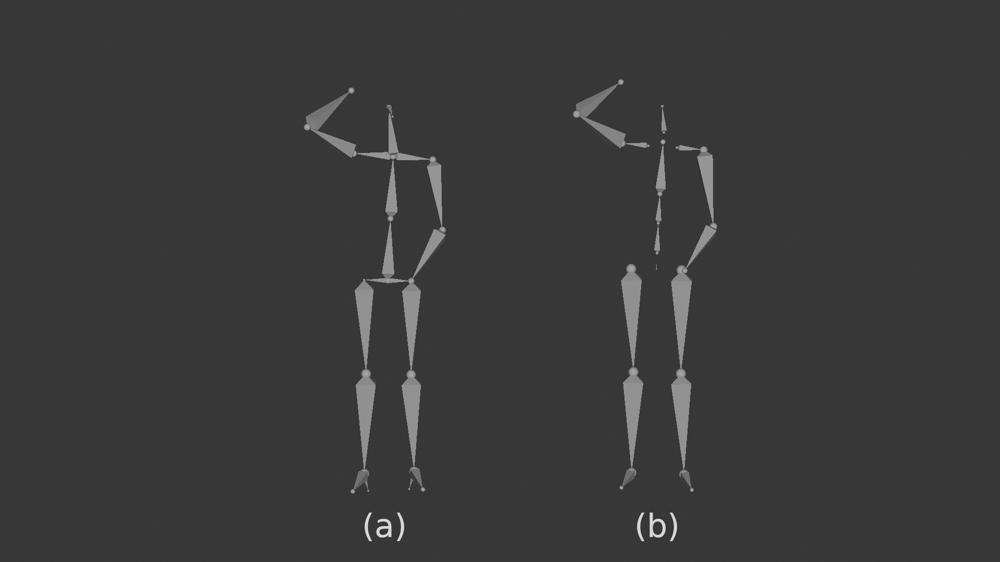

# StayStill: a 3d idle animation dataset
This repository will contain the animation data for the StayStill dataset. The repository is still work in progress, but you can give it a star if you want to follow the development and publishing of the data.
## Idle Motion Generation using the data (Teaser/WIP)
The data has already been used to train a motion generator. The video below shows some preliminary results. (Left: SLERP, Middle: Ground Truth, Right: Generator)

https://github.com/user-attachments/assets/6435fe4f-e60c-4601-860e-bcb0e6e7731b

## Citing
This section will be updated when the data is published.
## Data
The dataset contains BVH files for all the animations.
The data is divided into 2 folders:
- **Original**: It contains the original skeleton provided by Freemocap (without the finger bones) (a)
- **Lafan**: It contains the data retargeted to fit the LaFAN1 skeleton. (b)

Each of these two folders has 3 subfolders:
- **Idle**: Contains 2 minutes long sequences of people idling
- **Phone**: Contains 2 minutes long sequences of people idling while using a phone
- **Actions**: Contains 18 different actions that are typical in idle scenarios

Each animation clip is named as so:

[person ID][action_name][take_number].bvh

The following table presents the data in a more specific manner:

| Motion Type | Nº of frames | Duration (hh:mm:ss) | Nº of clips
|:---|:---:|:---:|:---:|
| Idle action: look up/sky | XXXXX | XX:XX:XX | XX |
| Idle action: look around | XXXXX | XX:XX:XX | XX |
| Idle action: look down/floor | XXXXX | XX:XX:XX | XX |
| Idle action: look shoes | XXXXX | XX:XX:XX | XX |
| Idle action: check watch | XXXXX | XX:XX:XX | XX |
| Idle action: check phone | XXXXX | XX:XX:XX  | XX |
| Idle action: scratch head | XXXXX | XX:XX:XX | XX |
| Idle action: scratch arm | XXXXX | XX:XX:XX | XX |
| Idle action: scratch leg | XXXXX | XX:XX:XX | XX |
| Idle action: scratch back | XXXXX | XX:XX:XX | XX |
| Idle action: touch face/chin | XXXXX | XX:XX:XX | XX |
| Idle action: stretch arms | XXXXX | XX:XX:XX | XX |
| Idle action: stretch back | XXXXX | XX:XX:XX | XX |
| Idle action: rub eyes | XXXXX | XX:XX:XX | XX |
| Idle action: yawn | XXXXX | XX:XX:XX | XX |
| Idle action: look back (left) | XXXXX | XX:XX:XX | XX |
| Idle action: look back (right) | XXXXX | XX:XX:XX | XX |
| Idle action: change balance left -> right | XXXXX | XX:XX:XX | XX |
| Idle action: change balance right -> left| XXXXX | XX:XX:XX | XX |
| **Idle actions total** | **XXXXX** | **XX:XX:XX** | **XX** |
| **General Idle** | **XXXXX** | **XX:XX:XX** | **XX** |
| **Idle with a phone** | **XXXXX** | **XX:XX:XX** | **XX** |

## License
The dataset provided in this repository is released under the **MIT License**.  
You are free to use, copy, modify, merge, publish, distribute, sublicense, and/or sell copies of the dataset, under the conditions outlined in the MIT License.

See [LICENSE.txt](LICENSE.txt) for full license text.
